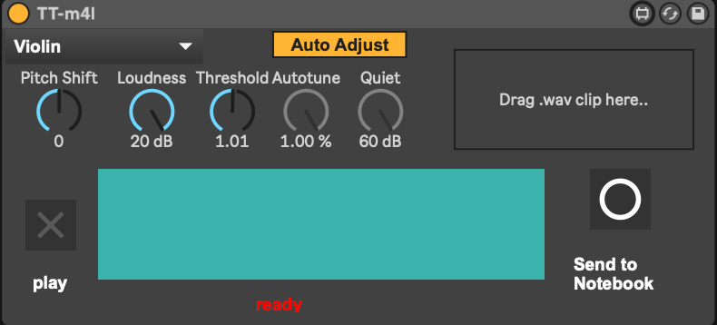

# M4L DDSP Timbre Transfer

This device connects [DDSP](https://github.com/magenta/ddsp)'s [timbre transfer notebook](https://colab.research.google.com/github/magenta/ddsp/blob/master/ddsp/colab/demos/timbre_transfer.ipynb) with Max(for-live) using Google Drive's API  for sharing files. It uses Google Colab's servers for actual the processing.



It allows the five instruments from the original notebook - Violin, Trumpet, Flute, Flute2, & Tenor Saxophone.

It consists of a python script, m4l-patch, and a Google Colab Notebook.

PyDrive is used for sharing audio files and JSON-settings between patch and Colab Notebook. [This means you need to get a api key For the local python end, and save it as client_secrets.json in the same folder as the python script.](https://pythonhosted.org/PyDrive/quickstart.html#authentication)

python drive-sync.py --init True creates a Folder called "M4L-Timbre-Transfer-Folder" in your Google Drive root. Audio files from your local computer will be sent to this folder, and the Notebook will find them, and process them. The script will prompt you to clear it on start. Remember to clear the folder with the script for downloaded files that have previously been timbre transfered.

## Instructions

1. install python ( and pip ```$ sudo easy_install pip
$ sudo pip install --upgrade pip```)
2. Open your Terminal and write the following commands ``` pip install python-osc```
``` pip install librosa```
``` pip install pydrive```
``` pip install numpy ```
``` pip install soundfile ```
4. [read this](https://pythonhosted.org/PyDrive/quickstart.html#authentication) - Get the API key json-file as is described, and save it as client_secrets.json in the same folder as the drive-sync.py file.
5. The first time you run drive-sync.py you'll need to make new folder on your Google Drive, to put the audio-files and settings. Running this command in your terminal  ``` python drive-sync.py --init True``` (or simply write python and drag the drive-sync.py file in to get the specific path if you're new to a terminal ) runs the script for the first time, creates a folder called 'M4l-Timbre-Transfer' in the root of your Google Drive. The ID for this folder is saved in folderID.txt. You can also look at PyDrives documentation, and define you own folders ID as the folderID.txt. When you've initialised it, and stored the ID, you can just type run ```python drive-sync.py```
6. Open the [notebook in Google Colab.](https://colab.research.google.com/github/nielsr2/M4L-DDSP-Timbre-Transfer/blob/master/m4l_timbre_transfer.ipynb)
7. Run all the cells, import libraries, loading functions, and the loop. When the loop cell is running, it is looking for new files to process.
8. The M4L-device will now send OSC-messsages to the python script with settings, and the file to upload to Google Drive.
9. See video for use

## Dependencies

* [PyDrive](https://pythonhosted.org/PyDrive/) - for Google Drive access
* [PythonOsc](https://github.com/attwad/python-osc) - for patch -> python script communication
* [DDSP](https://github.com/magenta/ddsp) (Timbre Transfer Demo Notebook) - The original notebook can be changed, and requires changes for this too.


## Other notes

This is script kiddie timbre transfer - ["Have fun! And please feel free to hack this notebook to make your own creative interactions.“ - Magenta ](https://colab.research.google.com/github/magenta/ddsp/blob/master/ddsp/colab/demos/timbre_transfer.ipynb)

Be sure not to share your Google Drive API key.. They've been added to the gitignore.

[Here's a small video showing the device in action](https://player.vimeo.com/video/429263185)


## TODO's

You're welcome to extend on it.

* Test Windows support
* Show spectral images from notebook?
* Describe settings
* Make procedure smoother
* Make better instructions
* Find better way to get transferred audio into Ableton as a clip (right now it only loads the audio into a buffer you can playback, and then record)
* Find bugs!
* It seems only to be working for wav-files or similar, located in a non-temporary folder.
