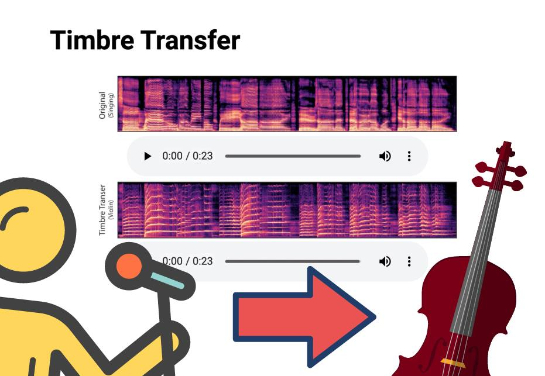

# M4L DDSP Timbre Transfer

This device connects [DDSP](https://github.com/magenta/ddsp)'s [timbre transfer notebook](https://colab.research.google.com/github/magenta/ddsp/blob/master/ddsp/colab/demos/timbre_transfer.ipynb) with Max(for-live) using Google Drive's API  for sharing files. It uses Google Colab's servers for actual the processing. 

It allows the five instruments from the original notebook - Violin, Trumpet, Flute, Flute2, & Tenor Saxophone.

It consists of a python script, m4l-patch, and a Google Colab Notebook. 

PyDrive is used for sharing audio files and JSON-settings between patch and Colab Notebook. [This means you need to get a api key For the local python end, and save it as client_secrets.json in the same folder as the python script.](https://pythonhosted.org/PyDrive/quickstart.html#authentication)

python drive-sync.py --init True creates a Folder called "M4L-Timbre-Transfer-Folder" in your Google Drive root. Audio files from your local computer will be sent to this folder, and the Notebook will find them, and process them. The script will prompt you to clear it on start. Remember to clear the folder with the script for downloaded files that have previously been timbre transfered. 

## Dependencies

* [PyDrive](https://pythonhosted.org/PyDrive/) - for Google Drive access
* [PythonOsc](https://github.com/attwad/python-osc) - for patch -> python script comminucation
* [DDSP](https://github.com/magenta/ddsp) (Timbre Transfer Demo Notebook) - The original notebook can be changed, and requires changes for this too.

## Other notes

This is script kiddie timbre transfer - ["Have fun! And please feel free to hack this notebook to make your own creative interactions.“ - Magenta ](https://colab.research.google.com/github/magenta/ddsp/blob/master/ddsp/colab/demos/timbre_transfer.ipynb)

Be sure not too share your Google Drive API key.. They've been added to the gitignore.

## TODO's

You're welcome to extend on it. 

* Test Windows support
* Show spectral images from notebook?
* Describe settings
* Make procedure smoother 
* Make better instructions
* Find better way to get transferred audio into Ableton as a clip (right now it only loads the audio into a buffer you can playback, and then record)
* Find bugs!
* It seems only to be working for wav-files or similar, located in a non-temporary folder.

